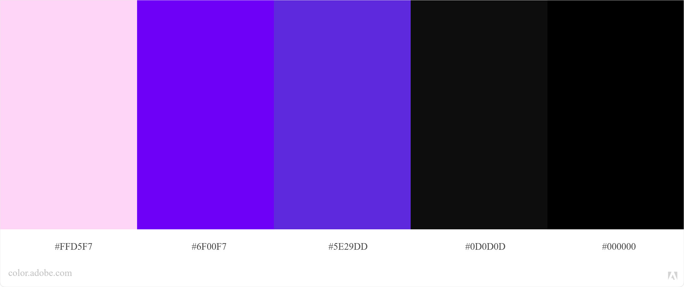

# LABENINJAS

<h4 align="center"> 
	🚧  React Select 🚀 Em construção...  🚧
</h4>

## Paleta de cores:

## Descrição do Projeto:

O projeto terá 4 telas principais:

* Tela de boas-vindas: onde será possível selecionar se deseja contratar um serviço ou oferecer um serviço;
* Tela de cadastro de serviços: onde o prestador de serviços irá preencher um formulário para o cadastro do serviço;
* Tela de serviços: onde os serviços cadastrados serão dispostos e o tomador poderá buscar e selecionar os serviços;
* Tela de carrinho: onde o usuário poderá revisar os serviços selecionados e ir para o pagamento;

As telas irão estar abrigadas pelo componente “Main” e serão renderizadas conforme o usuário for selecionando.

